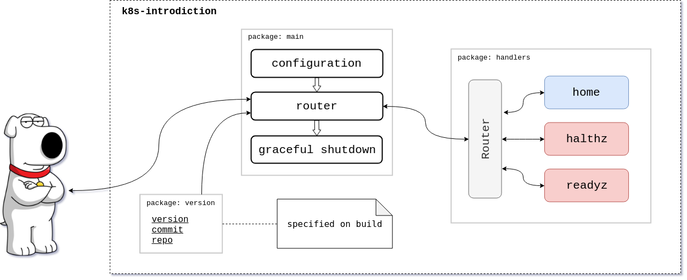

# Introducion into CI/CD & Kubernetes

Step-by-step process of deployment a simple Go web-service into Kubernetes

## Step 1. Pre-commit-hooks

A set of configurable code quality checks to perform before committing.
Specify hooks in `.pre-commit-config.yaml` file:


```
-   repo: git://github.com/dnephin/pre-commit-golang      # repo with hooks
    sha: 471a7c123ea7a3b776ff018edf00066947873a94         # revision
    hooks:
    -   id: go-fmt                                        # single codestyle analyzer
    -   id: go-vet                                        # check for any errors in packages
    -   id: go-lint                                       # check for any errors in code
```

## Step 2. Simple Go web-service architecture



### Router

Current microservice uses `gorilla/mux` router. Its constructor accepts basic microservice metadata in order to display it on `home` GET request.

```
func Router(version, commit, repo string) *mux.Router{
	isReady := &atomic.Value{}
	isReady.Store(false)
	go func() {
		log.Printf("Readyz probe is negative by default...")
		time.Sleep(10 * time.Second)
		isReady.Store(true)
		log.Printf("Readyz probe is positive.")
	}()

	r := mux.NewRouter()
	r.HandleFunc("/", root).Methods("GET")
	r.HandleFunc("/home", home(version, commit, repo)).Methods("GET")
	r.HandleFunc("/healthz", healthz)
	r.HandleFunc("/readyz", readyz(isReady))

    return r
}
```

### Logging

Use standart go library `log` for logging, to be aware of what is happening on the server side.

### Home GET request handler

On `GET` request on `/home` server will respond information about the version of application, repository name and commit hash  in json format. All this information is specified in `version` package.

```
func home(version, commit, repo string) http.HandlerFunc {
	return func(w http.ResponseWriter, _ *http.Request) {
		info := struct {
			Version   string `json:"version"`
			Commit    string `json:"commit"`
			Repo      string `json:"repo"`
		}{
			version, commit, repo,
		}
		body, err := json.Marshal(info)
		if err != nil {
			log.Printf("Could not encode info data: %v", err)
			http.Error(w, http.StatusText(http.StatusServiceUnavailable), 
						http.StatusServiceUnavailable)
			return
		}
		w.Header().Set("Content-Type", "application/json")
		w.Write(body)
	}
}
```

### Healthchecks: liveness & readiness

Kubernetes uses **liveness** probes to know when to restart a container. If a container is unresponsive — perhaps the application is deadlocked due to a multi-threading defect — restarting the container can make the application more available, despite the  defect. Just to be sure that the service can respond.

```
func healthz(w http.ResponseWriter, _ *http.Request) {
	w.WriteHeader(http.StatusOK)
}
```

Kubernetes uses **readiness** probes to decide when the container is available for accepting traffic.

```
func readyz(isReady *atomic.Value) http.HandlerFunc {
	return func(w http.ResponseWriter, _ *http.Request) {
		if isReady == nil || !isReady.Load().(bool) {
			http.Error(w, http.StatusText(http.StatusServiceUnavailable),
						http.StatusServiceUnavailable)
			return
		}
		w.WriteHeader(http.StatusOK)
	}
}
```

### Graceful shutdown

Graceful shutdown mean that if server gets os signal to stop he will finish all current jobs before actually shut down.

Here we ask the `srv` to be stop if an error being recieved

```
shutdown := make(chan struct{}, 1)
go func() {
    err := srv.ListenAndServe()
    if err != nil {
        shutdown <- struct{}{}
        log.Printf("%v", err)
    }
}()
```

Print the log with reason the server was stopped and then finaly shutdown.

```
select {
case killSignal := <-interrupt:
    switch killSignal {
    case os.Interrupt:
        log.Print("Got SIGINT...")
    case syscall.SIGTERM:
        log.Print("Got SIGTERM...")
    }
case <-shutdown:
    log.Printf("Got an error...")
}

srv.Shutdown(context.Background())
```

### Build & run application

Build go application

```
$ GOOS=linux CGO_ENABLED=0 go build
```

Build and tag container with `k8s-introduction` app

```
$ docker build -t k8s-introduction -f ./Dockerfile .
```

How to run `k8s-introduction` app with 8000 port forwading

```
$ docker run -p 8000:8000 k8s-introduction
```

## Step 3. Tests

## Step 4. Managing dependencies with Glide

There is `glide.yaml` file which contains project dependencies and their versions.

```
package: .
import:
- package: github.com/Sirupsen/logrus   # dependency repo
  version: ^1.3.0                       # dependency version
...
```

You can install dependencies by run `$ glide install`

For more information just visit [glide repository](https://github.com/Masterminds/glide)

## Step 5. Configuring & Versioning

## Step 6. CI/CD process in Makefile

### clean

Removes previously builded app

### vendor

Check for dependencies with glide

### build

Build go application

### container

Build cintainer with installed application

### push

Push builded container into DockerHub container registry

### run

Starts container application

## Step 7. Deploy into minikube

